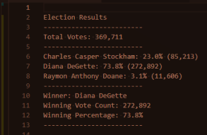

# Election Analysis
Python project to create a vote count report that audits and certifies election results.

## Project Overview
---
A Colorado Board of Elections employee has asked for an election audit of a recent local congressional election. The vote count report includes the following:
- A calculation of the total number of votes cast
- A complete list of candidates who received votes
- A calculation of the total number of votes each candidate received
- A calculation of the percentage of votes each candidate won
- A determination of the winner of the election based on popular vote

## Resources
---
**Data Source:** [election_results.csv](Resources/election_results.csv)

**Software:** Python 3.9.2, Visual Studio Code 1.54.2

## Summary
---

The analysis of the election data show:

- There were 369,711 votes cast in the election.

- The candidates:
  - Charles Casper Stockham
  - Diana DeGette
  - Raymon Anthony Doane

- The candidate results were:
  - Charles Casper Stockham received 23% of the the votes with 85,213 votes
  - Diana DeGette received 73.8% of the the votes with 272,892 votes
  - Raymon Anthony Doane received 3% of the the votes with 11,606 votes

- The election winner was:
   - Diana DeGetter who received 73.8% of the the votes

## Challenge Overview
---
We used the [elections results file](Resources/election_results.csv) from the Colorado Board of Elections. We used Python in Visual Studio Code import the .csv data and write an algorithm to analyze the data and produce the [election analysis report](analysis/election_analysis.txt).

## Challenge Summary
---
The source file from the Colorado Board of Elections for analysis was a .csv file which held election data collected from hand-counted mail-in ballots, machine-counted punchcards and computer-counted Direct Record Electronic memory cards. 

**Python and Visual Studio Code**

We used Visual Studio Code to import and inspect the .csv file to discover it contained ballot id, election county and candidate names data. Overall, the data was readable and there were no unusual row values.

Through running a series of Python loops, we iterated through the 369,711 votes cast to first discover the names of each candidate, then by creating a dictionary of key-value pairs to calculate the number of votes each candidate received, we were able to calculate the percentage of total votes each candidate received to determine the winner with the highest percentage of votes.